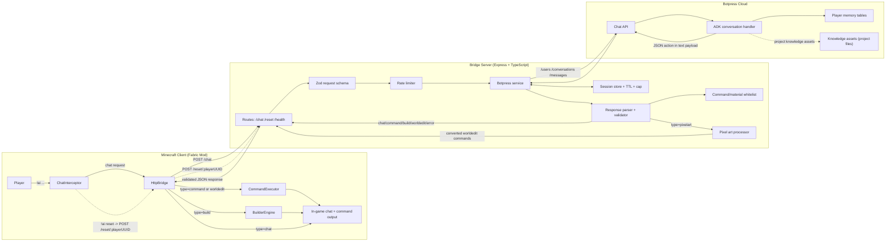
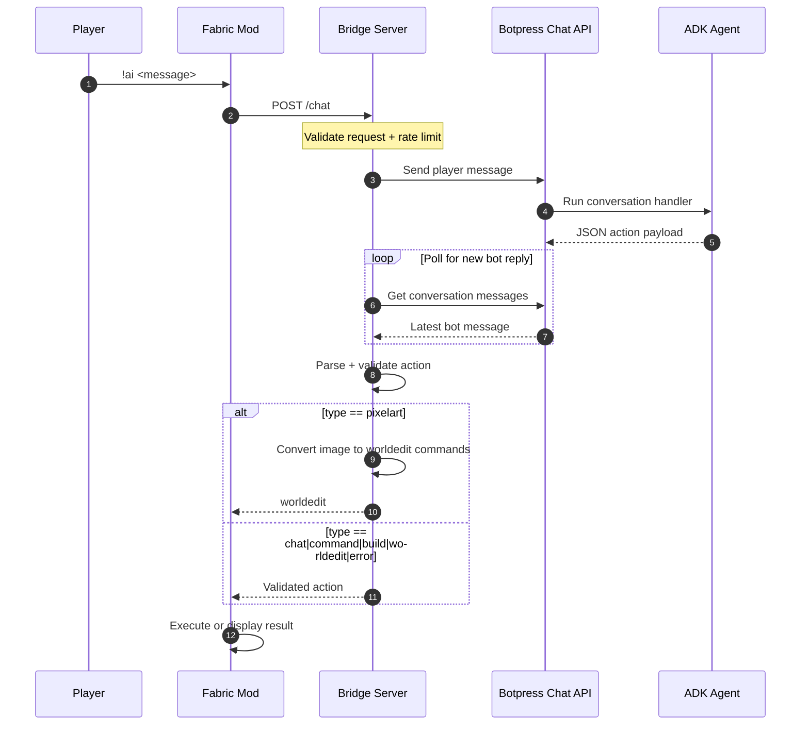
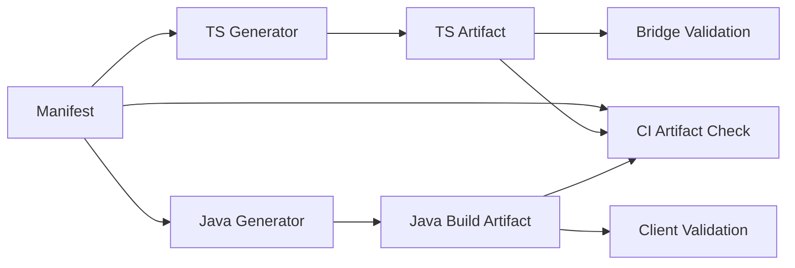

# MineBot AI

MineBot AI is a local stack that lets players use `!ai` inside Minecraft to chat, run safe commands, generate builds, and render pixel art.

It has three parts:
- A Fabric client mod that intercepts `!ai` chat and executes validated responses in-game.
- A TypeScript bridge server that talks to Botpress Chat API and enforces response safety.
- A Botpress ADK agent that classifies intent into structured JSON.

## Quick Start

1. Clone the repo:
```bash
git clone https://github.com/carsonSgit/minecraft-botpress.git
cd minecraft-botpress
```
2. Start the ADK agent:
```bash
cd minebot-agent
bun install
adk login
adk dev
```
3. Start the bridge server:
```bash
cd ../bridge-server
bun install
cp .env.example .env
bun run dev
```
4. Run Minecraft with the mod from repo root:
```bash
./gradlew runClient
```
Windows PowerShell:
```powershell
.\gradlew.bat runClient
```

Then use `!ai hello` in chat.

## How It Works at a Glance

1. The Fabric client catches `!ai` messages in chat.
2. It sends player context to the bridge server (`POST /chat`).
3. The bridge calls Botpress Chat API, gets the agent response, and validates it.
4. The client executes the validated result in-game (chat, command, build, or worldedit sequence).

## System Architecture



Path map:
- Fabric mod:
- `src/client/java/com/botpress/chat/ChatInterceptor.java`
- `src/client/java/com/botpress/network/HttpBridge.java`
- `src/client/java/com/botpress/command/CommandExecutor.java`
- `src/client/java/com/botpress/build/BuilderEngine.java`
- Bridge server:
- `bridge-server/src/index.ts`
- `bridge-server/src/types.ts`
- `bridge-server/src/rate-limiter.ts`
- `bridge-server/src/botpress-service.ts`
- `bridge-server/src/validator.ts`
- `bridge-server/src/whitelist.ts`
- `bridge-server/src/pixel-art.ts`
- ADK agent:
- `minebot-agent/src/conversations/index.ts`
- `minebot-agent/src/tables/player-prefs.ts`
- `minebot-agent/src/tables/build-history.ts`
- `minebot-agent/src/knowledge/minecraft-kb.ts`

## Request/Response Flow



## Command Safety and Artifact Flow



Path map:
- Manifest: `shared/command-whitelist.json`
- TS generator: `scripts/generate-command-artifacts.mjs`
- Java generator task: `build.gradle` (`generateCommandWhitelistJava`)
- TS artifact (tracked): `bridge-server/src/generated/command-whitelist.ts`
- Java build artifact (not tracked): `build/generated/sources/commandWhitelist/java/main/com/botpress/command/GeneratedCommandWhitelist.java`
- Runtime validation: `bridge-server/src/validator.ts`, `bridge-server/src/whitelist.ts`, `src/main/java/com/botpress/command/CommandValidation.java`
- CI check: `./gradlew checkCommandArtifacts`

## Public Bridge Interface

### Endpoints

| Method | Path | Purpose |
|---|---|---|
| `GET` | `/health` | Health and cleanup stats |
| `POST` | `/chat` | Main AI request/response endpoint |
| `POST` | `/reset/:playerUUID` | Clear one player session |
| `POST` | `/reset-all` | Clear all sessions |

Defined in `bridge-server/src/index.ts`.

### `POST /chat` Request

Defined by `ChatRequestSchema` in `bridge-server/src/types.ts`.

| Field | Type | Required |
|---|---|---|
| `playerName` | `string` | Yes |
| `playerUUID` | `string` | Yes |
| `message` | `string` (1-500 chars) | Yes |
| `playerX` | `int` | No |
| `playerY` | `int` | No |
| `playerZ` | `int` | No |

### `POST /chat` Response Types

Defined by `ChatResponseSchema` in `bridge-server/src/types.ts`.

| `type` | Payload |
|---|---|
| `chat` | `text` |
| `command` | `command` |
| `build` | `structure`, `width`, `height`, `depth`, `material` |
| `worldedit` | `description`, `commands[]`, optional `strictMode` |
| `pixelart` | `url`, optional `size` (bridge converts this into `worldedit` before returning to mod) |
| `error` | `text` |

## Runtime Behavior

### Cooldown and Rate Limiting

- Client-side cooldown is enforced in `src/client/java/com/botpress/chat/ChatInterceptor.java` (`2s` between `!ai` requests).
- Bridge-side cooldown is enforced in `bridge-server/src/rate-limiter.ts` (`2s` per player UUID, plus TTL cleanup).

### Session Lifecycle

- Bridge session state is managed in `bridge-server/src/botpress-service.ts` using `SESSION_TTL_MS` and `MAX_SESSIONS`.

### Pixel Art Conversion

- The agent can return `type: "pixelart"`.
- The bridge processes the image in `bridge-server/src/pixel-art.ts` and converts it into `worldedit` commands before returning to the client.

### Strict vs Non-Strict WorldEdit

- Sequence validation runs in `src/client/java/com/botpress/command/CommandExecutor.java`.
- `strictMode=true`: abort on first invalid command.
- `strictMode=false`: skip invalid commands and continue; abort only if no valid commands remain.

## Setup and Configuration

### Prerequisites

| Tool | Version |
|---|---|
| Java (JDK) | 21+ |
| Bun | latest |
| Node.js | 20+ recommended (used by Gradle artifact generation script) |
| Botpress ADK CLI | latest (`npm install -g @botpress/adk`) |
| Minecraft | 1.21.11 |

### Bridge Server Environment

Copy `bridge-server/.env.example` to `bridge-server/.env` and set:

```env
BOTPRESS_WEBHOOK_ID=your-webhook-id-here
PORT=3000
SESSION_TTL_MS=1800000
RATE_LIMIT_TTL_MS=300000
MAX_SESSIONS=10000
```

The ADK chat integration dependency is enabled in `minebot-agent/agent.config.ts` (`chat@0.7.5`).

### Build and Run Commands

- Fabric mod build: `./gradlew build`
- Fabric dev client: `./gradlew runClient`
- Regenerate command artifacts: `./gradlew generateCommandArtifacts`
- Check artifact freshness (used in CI): `./gradlew checkCommandArtifacts`
- Bridge dev server: `cd bridge-server && bun run dev`
- Agent dev server: `cd minebot-agent && bun run dev`
- Agent deploy: `cd minebot-agent && bun run deploy`

## Command Whitelist Maintenance

1. Edit `shared/command-whitelist.json`.
2. Run:
```bash
./gradlew generateCommandArtifacts
```
3. Commit:
- `shared/command-whitelist.json`
- `bridge-server/src/generated/command-whitelist.ts`

Do not commit `build/generated/.../GeneratedCommandWhitelist.java`; it is generated during build.

## Repository Map

```text
src/client/java/com/botpress/
  chat/ChatInterceptor.java
  network/HttpBridge.java
  command/CommandExecutor.java
  build/BuilderEngine.java

src/main/java/com/botpress/
  command/CommandValidation.java

bridge-server/src/
  index.ts
  botpress-service.ts
  validator.ts
  whitelist.ts
  pixel-art.ts
  rate-limiter.ts
  types.ts
  generated/command-whitelist.ts

minebot-agent/src/
  conversations/index.ts
  tables/player-prefs.ts
  tables/build-history.ts
  knowledge/minecraft-kb.ts
  knowledge/minecraft/*.md
  actions/index.ts (scaffold placeholder)
  workflows/index.ts (scaffold placeholder)
  triggers/index.ts (scaffold placeholder)
```

## In-Game Usage

- `!ai <message>` asks MineBot to classify and respond.
- `!ai help` shows usage examples from the client mod.
- `!ai reset` clears the player's bridge session.

## Truth Guarantees

- This README is grounded in current source paths and runtime behavior.
- If a statement here conflicts with code, code is the source of truth.
- Key behavioral sections map directly to:
- `src/client/java/com/botpress/chat/ChatInterceptor.java`
- `src/client/java/com/botpress/network/HttpBridge.java`
- `src/client/java/com/botpress/command/CommandExecutor.java`
- `bridge-server/src/index.ts`
- `bridge-server/src/types.ts`
- `bridge-server/src/validator.ts`
- `bridge-server/src/botpress-service.ts`
- `minebot-agent/src/conversations/index.ts`

## License

MIT
